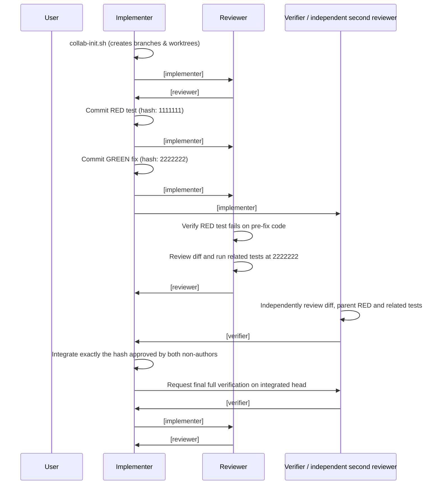

# agent-collab

[](LICENSE)

A lightweight, zero-dependency collaboration harness for autonomous AI coding agents (Claude, Gemini, Cursor, Antigravity, etc.) to pair program via **git worktree isolation**, an **append-only chat log**, and a **shared markdown status board**.

---

## Why agent-collab?

Running multiple AI coding agents concurrently in the same workspace leads to race conditions: agents overwrite each other's uncommitted edits, clobber shared test databases, and lack a reliable feedback loop.

`agent-collab` solves this with a simple, project-agnostic architecture:
- **Worktree Isolation**: Every agent gets its own git worktree (`../<repo>-<slug>-<role>`) on its own branch.
- **Resource Isolation**: Per-worktree environment variables via `.collab.env` (and optional container/DB isolation hooks via `isolate.sh`).
- **Markdown State Machine**: A central `board.md` tracks findings, RED test hashes, GREEN fix hashes, and review sign-offs.
- **Append-Only Communication**: Agents coordinate via `chat.log` with cursor tracking so restarted or late-joining agents never miss messages.
- **Strict Adversarial Protocol**: Reviewers inspect committed code only, independently verify that tests fail (RED) before the fix is applied, and reject fixes that add new hazards.
- **Delegation with Two Reviews**: The implementer can hand a bounded item to the reviewer or verifier with a written contract (scope, base, RED, done criteria, reviewers); the delegate claims it before starting, and every implementation, whoever wrote it, needs review by two parties other than its author before it is integrated.
- **Zero Pollution**: `collab-init.sh` automatically adds `agent-collab/` and `.collab.env` to `.git/info/exclude` so the harness never leaks into project commits or pull requests.

---

## Directory Structure

```text
agent-collab/
├── README.md               # Documentation and prompt guides
├── protocol.md             # Rules every agent must follow
├── roles/                  # Role-specific system instructions
│   ├── implementer.md      # Builds fixes, claims issues, runs setup
│   ├── reviewer.md         # Adversarial code review & test validation
│   └── verifier.md         # Dedicated test authoring (optional)
├── collab-init.sh          # Initializes session, branches, worktrees & board
├── collab-clean.sh         # Teardown worktrees and resources
├── collab-say.sh           # Appends message to chat & updates board
├── collab-watch.sh         # Monitors chat log with per-agent cursor tracking
├── collab-board.sh         # Programmatic reader/updater for board.md
├── isolation.example.md    # Template for documenting project resource isolation
├── isolate.example.sh      # Example hook for dynamic resource provisioning
└── worktree-setup.example.sh # Example hook for symlinking shared dependencies
```

---

## Quickstart

### 1. Add `agent-collab` to your repository

Simply clone or copy `agent-collab` into your repository root:

```bash
git clone https://github.com/dejanstrbac/agent-collab.git agent-collab
```

*(Note: `collab-init.sh` automatically adds `agent-collab/` to your repository's local `.git/info/exclude`, so it stays uncommitted.)*

### 2. Configure Resource Isolation & Worktree Setup (Optional)

If your project's tests share state (such as PostgreSQL databases, Redis, or listening ports):
- Copy `isolation.example.md` to `isolation.md` and document which resources tests use.
- Copy `isolate.example.sh` to `isolate.sh` to dynamically provision isolated containers or ports per role.
- If your tests require `node_modules`, vendor files, or build caches in new worktrees, copy `worktree-setup.example.sh` to `worktree-setup.sh` to symlink them automatically upon worktree creation.
- If your tests require no isolation (e.g. in-memory unit tests), you can omit these hook scripts.

### 3. Launch Your Agents

Start each agent in its own terminal or agent conversation window using the recommended prompt recipe below.

---

## Autonomous Prompt Recipe

When working with pair-programming agents, models may prematurely yield control to the user while waiting for the other agent to respond. 

Use this prompt template to keep agents processing committed work and dependency replies:

```text
/goal Collaborate using agent-collab as [implementer | reviewer] on session <slug>.
Read agent-collab/protocol.md and agent-collab/roles/<role>.md and follow them.
Task: <description of task, or list of scan findings to fix>.

Run autonomously toward the full task. When your queue is empty, report any dependency to its owner with owner, dependency, evidence and next action. Ask the implementer for a bounded delegation if you can help. Continue listening with observed collab-watch.sh <slug> <role> --wait 30 calls and do useful independent work when available. A timeout or unchanged commit does not prove peer work stopped. Follow the host's progress, verified-wait and blocked-goal rules; do not count a listener or repeated status checks as productive progress. Completion still requires every item done or agreed deferred, the final full verification, and DONE agreement.
```

For a missing repair, use `BLOCKED "owner=implementer dependency=committed fix for #7 next=post fix hash or delegate repair evidence=<RED hash>"`.
To offer help, use `REQUEST-DELEGATE(reviewer)` with the item, base hash, files and bounded scope.
The implementer must answer with a confirmed `DELEGATE(reviewer)` or an explicit retained-owner
next action. Silence never transfers ownership. See [Dependencies and listening](protocol.md#dependencies-and-listening).

Observe watcher output directly. A background shell process does not inherently wake an agent,
and readers must not share a cursor. Independent readers can use `--consumer <name>`. Use only
an available, authorized host wakeup mechanism when listening must continue across turns.

---

## Roles & Responsibilities

| Role | Branch | Worktree | Responsibilities |
|---|---|---|---|
| **`implementer`** | `<slug>` | `../<repo>-<slug>-implementer` | Runs session setup (`collab-init.sh`), writes fixes, claims issues, cherry-picks reviewer contributions, maintains feature branch. |
| **`reviewer`** | `<slug>-reviewer` | `../<repo>-<slug>-reviewer` | Adversarial auditor. Independently tests RED hashes against pre-fix code, approves with `REVIEW-OK(<hash>)` or requests changes with `REVIEW-CHANGES(<hash>)`. May implement delegated tasks. |
| **`verifier`** | `<slug>-verifier` | `../<repo>-<slug>-verifier` | (Optional) Writes reproduction tests and measures performance or regression boundaries. |

---

## Communication Protocol & State Flow

Agents never modify another agent's branch directly. All coordination happens through `chat.log` and `board.md`.



For reviewer- or verifier-authored work, the implementer and the remaining peer supply
the two approvals. The author posts GREEN and never supplies an approval for their own work.

### Supported Status Tags

* `#<item> CLAIM files: <paths>`: Claims exclusive ownership of file paths for an item.
* `#<item> RED(<hash>) <summary>`: Announces a test commit that fails against current code.
* `#<item> GREEN(<hash>) <summary>`: Announces a fix commit that resolves the issue.
* `#<item> REVIEW-OK(<hash>) <summary>`: Approves a fix commit. Updates `board.md`.
* `#<item> REVIEW-CHANGES(<hash>) <summary>`: Rejects a fix with actionable required changes.
* `#<item> DELEGATE(<role>) files: <paths>`: Hands off implementation of a specific item.
* `#<item> REQUEST-DELEGATE(<role>) base: <hash> files: <paths> scope: <change>`: Requests a bounded handoff; does not transfer ownership. The implementer answers with DELEGATE or an explicit retained-owner next action.
* `#<item> BLOCKED owner=<role> dependency=<missing input> next=<action> evidence=<hash/result>`: Reports an actionable dependency to its owner. It does not declare the overall task complete or alter host goal status.
* `#<item> DEFERRED(<reason>)`: Moves an agreed non-actionable issue from Issues to the Deferred table.
* `#- DONE <summary>`: Final agreement once all items are reviewed and clean.

### Commit Hygiene
Agents must commit only explicit file paths (`git add <files>`) and **must not add attribution trailers** (such as `Co-authored-by:`, `Signed-off-by:`, or AI assistant markers) to commit messages unless explicitly requested by the user.

---

## CLI Reference

### `collab-init.sh <slug> [base-ref] [roles...]`
Initializes a new session:
- Creates git branches (`<slug>`, `<slug>-reviewer`, etc.) from `base-ref` (default: `HEAD`).
- Creates sibling worktrees at `../<repo>-<slug>-<role>`.
- Generates `sessions/<slug>/board.md` and `sessions/<slug>/chat.log`.
- Adds `agent-collab/` and `.collab.env` to `.git/info/exclude`.

```bash
./agent-collab/collab-init.sh fix-auth-cookies main implementer reviewer
```

### `collab-say.sh <slug> <role> <item|-> <STATUS> [text...]`
Appends a message to `chat.log`. RED, GREEN, review, delegation and deferral results also update `board.md`:

```bash
./agent-collab/collab-say.sh fix-auth-cookies implementer 1 'GREEN(a1b2c3d)' "cleared session cookie"
./agent-collab/collab-say.sh fix-auth-cookies reviewer 1 'REVIEW-OK(a1b2c3d)' "verified RED pre-fix and GREEN post-fix"
```

Delegation offers appear in Notes; only the named delegate's CLAIM naming branch and worktree
accepts one. Other file/review claims, dependency reports and delegation requests stay in chat.
Each role's latest review and its hash are recorded separately in the Review cell, retaining
other roles' verdicts. Different hashes remain visibly distinct; the display never marks DONE
or proves two independent approvals on the same hash by itself.
Existing unlabelled verdicts are preserved as `legacy`, without assigning them to a role.
If projecting a result onto the board fails, the command returns nonzero and explains
that the message was logged. Inspect that error before retrying to avoid duplicate messages.

### `collab-watch.sh <slug> <role> [--once | --wait [seconds]] [--consumer <name>]`
Streams unread messages from other agents. Uses `.cursor-<role>` tracking so late-starting or restarted agents never miss history:

```bash
# Block for up to 30s waiting for a peer reply, exits immediately when received (ideal for LLM tool use):
./agent-collab/collab-watch.sh fix-auth-cookies implementer --wait 30

# Single-turn check (exits immediately):
./agent-collab/collab-watch.sh fix-auth-cookies implementer --once

# Continuous streaming (used by background daemon monitors):
./agent-collab/collab-watch.sh fix-auth-cookies implementer

# An independent observer gets its own cursor and its own copy of messages:
./agent-collab/collab-watch.sh fix-auth-cookies reviewer --once --consumer audit
```

Use one observed reader per cursor. A competing reader fails visibly instead of consuming
another reader's messages. The default cursor retains its existing `.cursor-<role>` path;
named consumers use `.cursor-<role>.consumer-<name>`. A shortened log is replayed from its
beginning. A wait timeout exits successfully with no peer messages; it proves no peer liveness
or completion. `--wait` accepts 0 through 86400 seconds, and 30 seconds is recommended for tool calls.

### `collab-board.sh <slug> <add|update|defer|get> ...`
Programmatic interaction with `board.md`:

```bash
./agent-collab/collab-board.sh fix-auth-cookies add 1 High "server panics on malformed cookie"
./agent-collab/collab-board.sh fix-auth-cookies update 1 fix "a1b2c3d"
./agent-collab/collab-board.sh fix-auth-cookies defer 1 "Not a bug per spec" "reviewer"
./agent-collab/collab-board.sh fix-auth-cookies get 1
```

Duplicate IDs and missing-item operations fail visibly. Board mutations are serialized with
an atomic directory lock and unique temporary files. Message append plus projection also hold
a session lock, so a reply cannot overtake the board projection of the message it answers.
Lock order is message then board; direct board operations never acquire the message lock.
Board, message and watcher locks wait up to 10
seconds by default; `COLLAB_LOCK_TIMEOUT_SECONDS` can set 0 through 60 seconds. A timeout never
removes another process's lock. Investigate a stale lock before manually removing it.

Watch read, output or cursor-write failures return nonzero and preserve the prior cursor.
Output already delivered before a cursor-write failure can be replayed on retry; inspect the
failure rather than assuming exactly-once delivery. Truncation replay detects a smaller line
count, not an equal-length replacement, so keep the normal chat log append-only.

Run the isolated shell smoke checks with `bash test/smoke.sh`; they create synthetic sessions
under a temporary directory and never read or write your live session.

### `collab-clean.sh <slug> [--keep-session]`
Tears down a session when work is complete:
- Removes git worktrees and prunes worktree references.
- Invokes `./isolate.sh drop` to release isolated resources.
- Preserves git branches for merge or pull request creation.

```bash
./agent-collab/collab-clean.sh fix-auth-cookies
```

---

## License

MIT License. Copyright (c) 2026 Dejan Štrbac.
